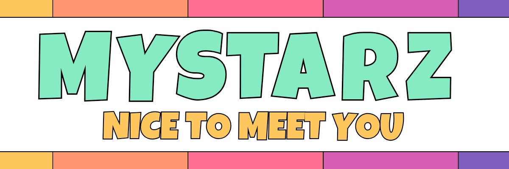

# MYSTARZ

## 1. 프로젝트 개요 (Introduction)

- MYSTARZ는 **팬과 스타가 함께 사회적 임팩트를 만들어가는 보상형 Web3 플랫폼**입니다. 사용자는 자신이 응원하는 스타가 주최하는 임팩트 캠페인에 펀딩 형태로 참여할 수 있으며, 캠페인이 목표 금액을 달성하면 리워드 형태의 NFT를 발급받아 보관, 거래, 또는 투표 참여 등에 활용할 수 있습니다.
- MYSTARZ는 복잡한 Web3 인터페이스가 아닌, Web2 사용자도 쉽게 적응할 수 있는 UI/UX와 실제 가치 있는 디지털 자산 중심의 보상 구조를 통해 대중과 스타, 비영리 기관이 함께 지속 가능한 임팩트를 만들어가는 새로운 형태의 Web3 참여 플랫폼입니다.
- 이번 해커톤에서는 팬의 참여 흐름부터 NFT 발급, 컬렉션 보관, 2차 거래, 참여 기반 투표 기능까지 실제 프로토타입으로 구현하여, **Web3 기술이 팬 커뮤니티와 사회적 가치 창출에 어떻게 접목될 수 있을 지를 제안**합니다.

## 2. 문제 정의 및 해결방안 (Problem & Solution)

- **문제 1.** 팬덤 참여의 한계
  - 팬들은 더 깊은 연결과 실질적 참여를 원하지만, 대부분은 소비 중심 구조에 갇혀 의미 있는 연결 수단이 부족함.
  - 팬 참여 앱은 높은 유지율(98%)을 보이며, 시장 규모도 급격하게 성장하는 중.
- **문제 2.** 임팩트 캠페인의 지속 불가능성
  - 사회적 캠페인은 대부분 인식(awareness) 단계에서 멈추며, 지속적 행동을 유도하지 못함.
  - 신규 기부자 유지율 : 13% (전년 대비 -9.0%)
  - 반복 기부자 유지율 : 50.3% (전년 대비 -4.6%)
- **문제 3.** Web3의 진입 장벽과 정서적 단절
  - Web3 플랫폼은 기술적 진입 장벽이 높고, Web2 유저에게는 UX가 복잡하고 감정적 연결이 부족함.
  - NFT는 96%가 사실상 사망(dead NFT) 상태이며, NFT의 평균 보유 기간은 약 1.14년, 의미 없는 자산으로 전락.
- **해결 방안 1.** 참여는 자산이 되도록 설계.
  - 기존에는 팬의 감정적 참여는 어디에도 남지 않던 구조.
  - MYSTARZ는 참여를 기록 가능한 데이터로 바꾸고 목표 달성 시 NFT 리워드를 발급.
  - NFT는 기념이 아니라 소유 가능한 자산.
  - 보관하거나 거래하거나, 플랫폼 안에서 순환 가능.
  - 참여가 끝이 아닌 시작이 되도록 설계함.
- **해결 방안 2.** 기여는 다음 행동으로 이어지도록 연결.
  - 기부하고 끝나는 구조는 임팩트 캠페인의 지속성을 만들기 어려움.
  - MYSTARZ는 캠페인 참여 이력을 NFT로 축적하고, 해당 이력은 투표, 리워드, 참여 자격 등으로 이루어짐.
  - 기여할수록 플랫폼 내에서 영향력이 커지는 구조.
  - 행동은 계속 연결되고, 참여는 커뮤니티로 성장함.
- **해결 방안 3.** Web2 유저도 몰입할 수 있도록 제작.
  - 기술이 아닌 감정 중심 UX로 구성.
  - 지갑 연결, 펀딩, 리워드 수령까지 Web2처럼 매끄럽게 설계.
  - NFT는 실물 리워드 교환이 가능하고, 본인만의 컬렉션이 됨.
  - 누구나 쉽게 참여하고, 자연스럽게 Web3에 닿을 수 있도록 함.
- **한 마디로 요약하면,** MYSTARZ는 팬의 참여를 디지털 자산과 실질적 영향력으로 바꾸는 참여 기반 플랫폼. "참여 → 보상 → 기억 → 영향력"의 구조로 설계함.

## 3. 주요 기능 (Features)

- **이니셔티브(캠페인)** 참여 기능
  - 팬은 스타/기업이 주최하는 캠페인에 펀딩 형태로 참여.
  - 캠페인 상세 페이지에서 소개 영상, 리워드 구성, 목표 금액 등 확인 가능.
  - 직관적이고 익숙한 Web2 UI 기반.
- NFT **리워드패스** 발급
  - 목표 금액 달성 시, 참여자에게 NFT 리워드패스 발급.
  - 리워드는 실물 교환, 추후 거래, 또는 캠페인 관련 권한 행사에 사용 가능.
  - 이용자는 컬렉션(NFT 지갑)에서 리워드를 보관 및 관리할 수 있음.
- NFT **임팩트배지** 발급
  - 펀딩에 참여한 모든 팬에게 임팩트배지 지급. (별도 보상과 무관)
  - 배지는 참여의 증명, 즉 "내가 이 캠페인에 함께 했다"는 감정적 인증 수단.
  - 개인의 활동 히스토리를 시각적으로 표현하며, 향후 투표 권한 또는 커뮤니티 레벨 시스템의 기준이 됨.
- **마켓플레이스** 기능
  - 리워드 NFT는 마켓에서 거래 가능
  - 희망가 등록, 실시간 시세 확인, 2차 수익 유입 가능
- **참여 기반의 투표** 기능 (거버넌스)
  - 마이스타즈 플랫폼 내에서 참여를 한 이력에 따라 투표 권한 자동 부여.
  - 이니셔티브를 주최하길 원하는 스타에 대한 투표를 진행할 수 있음.
  - 참여가 곧 영향력이 되는 구조.
- 리워드 외 추가 후원 기능
  - 리워드 수령과 별개로, 순수 기부를 위한 **추가 후원 옵션** 제공.
  - 팬이 더 의미 있게 캠페인에 참여할 수 있도록 유연한 선택 구조.

## 4. 기술 스택 (Tech Stack)

- **프로그래밍 언어 :** JavaScript / TypeScript, Solidity, Rust
- **프레임워크 :** Next.js, Axum, EQhub, FuturePass
- **라이브러리 / SDK :** ethers.js, hardhat, Axelar SDK / API
- **데이터베이스 :** PostgreSQL
- **인프라 / 프로토콜 :** Axelar, The Root Network, XRPL / XRPL EVM Sidechain

## 5. 기대효과 및 발전 가능성 (Future Improvements)

- **기대효과 1.** 감정적 참여가 실질적 자산으로 전환됨.
  - 팬의 참여가 단순한 좋아요나 댓글이 아니라 NFT 리워드패스 및 임팩트배지로 기록되고 소유되는 디지털 자산으로 전환.
  - 캠페인 참여가 '의미 있는 행동'으로 체감되며, 참여 이력은 컬렉션, 거래, 투표로 이어지는 구조 완성.
- **기대효과 2.** 플랫폼 내 자생적 순환 구조 형성
  - 펀딩 → 리워드 → 보관/거래 → 투표 → 재참여의 참여 기반 순환 생태계가 실현됨.
  - 단발성 이벤트가 아닌, 지속 가능한 팬-스타 관계가 형성되며 캠페인 중심 커뮤니티 활성화로 이어짐.
- **기대효과 3.** XRPL 기반 실사용 결제 흐름 구현 (RLUSDT 활용)
  - 캠페인 펀딩 및 NFT 거래 시, XRP 또는 RLUSDT를 활용하여 즉시 결제 + 투명한 정산 구조를 가능하게 함.
  - RLUSDT는 스테이블 코인 기반의 사용자 친화적 결제 수단으로, Web2 유저도 안정적으로 참여 가능. "Real-World Payments Use Case"를 직접 실현하는 구조.
- **발전 가능성 1.** RLUSDT 기반 실사용 결제 구조 완전 정착
  - 캠페인 참여 및 NFT 리워드 구매/추가 후원 등에서 RLUSDT를 주요 결제 수단으로 채택.
  - 크리에이터 정산, 리워드 자동 분배 등 RLUSDT 기반 실시간 결제 흐름으로 확장 가능.
- **발전 가능성 2.** 참여 NFT를 활용한 커뮤니티 보상 및 DAO 확장
  - NFT를 예치하지 않고도, 보유 인증을 통해 한정 리워드, 투표 권한, 배지 업그레이드 등에 참여 가능.
  - 이는 참여 지속성과 커뮤니티 몰입도를 자연스럽게 높이는 구조.
  - 향후에는 스타별 미니 DAO로 확장해 팬이 직접 캠페인을 기획·제안·의결하는 참여형 생태계로 진화 가능.

## 6. 팀원 소개 (Team)

- **오창민** (Project Manager) : 전체 프로젝트 기획 및 비즈니스 총괄, 대외 커뮤니케이션 총괄
- **황도연** (Smart Contract Developer) : 프로젝트 스마트 컨트랙트 개발 담당
- **김형근** (Designer) : 서비스 UX/UI 설계 및 프로토타입 시각 요소 전반 디자인
- **임희원** (Back-end Developer) : 사용자 데이터, 캠페인 정보 및 리워드 로직 API 서버 개발 담당
- **이병현** (Front-end Developer) : 참여 흐름 및 컬렉션/마켓플레이스 구현을 포함한 전체 프론트엔드 개발
